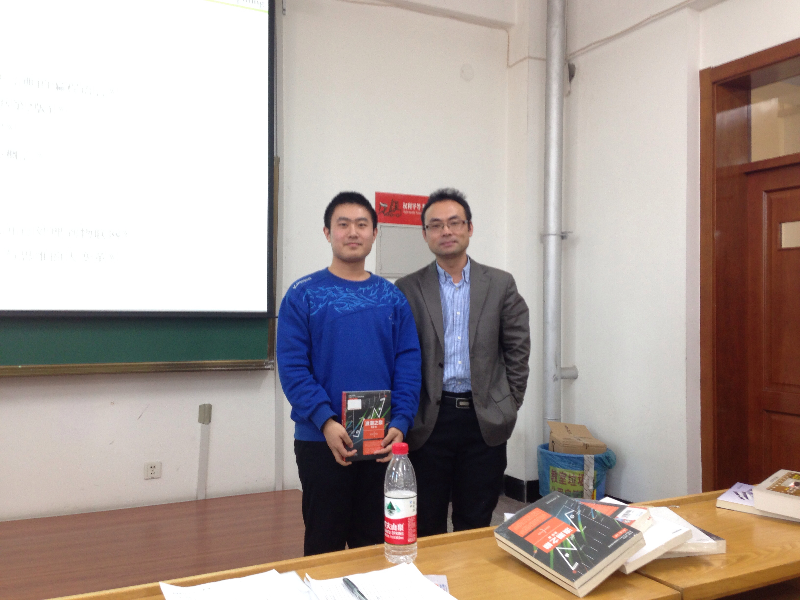

# Special-Topics-on-Services-Computing

An invited mini-course given at HIT to Computer Science Honors Class by Prof. Michael Sheng from University of Adelaide and Prof. Zhongjie Wang from HIT.

## Labs

Lab 1 is an experiment for building a SOAP based server and client in Python.

Lab 2 is a project of composing multiple web services into one (like `pipes` in Linux) to achieve more complex tasks. I completed a city life guide generator based on only the user's mobile phone number. The web services behind it are the `weather querying service` and the `mobile phone number to location mapping service`.

## Presentation

We gave a group presentation on this paper:

> Jagdeep Singh, Suhib Younis Bani Melhem, Roch H. Glitho, Fatna Belqasmi, "SOAP-Based vs. RESTful Web Services: A Case Study for Multimedia Conferencing", IEEE Internet Computing, vol. 16, no. , pp. 54-63, July-Aug. 2012, doi:10.1109/MIC.2012.62 

## Photos

We really had a wonderful time together in this mini-course. At the end of the course, we were awarded some books according to our performances in the presentations. I would love to keep some nice pictures here.

